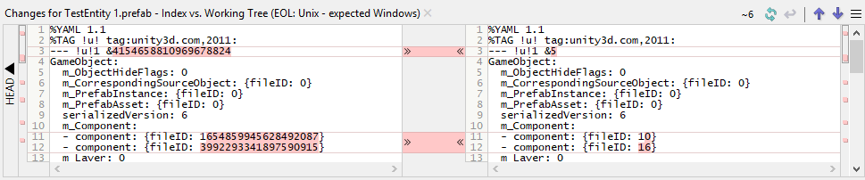

# TestMissingPrefabs

This is testing project to find out when prefab's asset ID changes that made reference to prefabs lost

## The issue

When build project, sometime at prefab's asset ID changes, I don't know why and when but I can noticed that problem happen to prefabs that attached component which have OnValidate function

## How to test it

Try switch platform or architecture then Build it